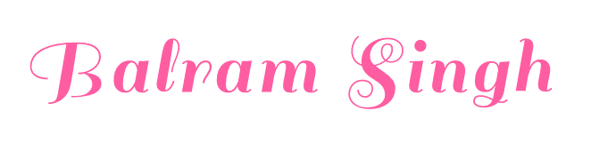

      

[Architecture](https://github.com/balramsinghindia/about-balram#architectures-and-libraries-created-from-scratch "Architecture")&nbsp;&nbsp;&nbsp;&nbsp;&nbsp;&nbsp;&nbsp;&nbsp;&nbsp;&nbsp;&nbsp;&nbsp;
[Talks](https://github.com/balramsinghindia/about-balram#talks "Talks")&nbsp;&nbsp;&nbsp;&nbsp;&nbsp;&nbsp;&nbsp;&nbsp;&nbsp;&nbsp;&nbsp;&nbsp;
[Trainings](https://github.com/balramsinghindia/about-balram#trainings-delivered "Trainings")&nbsp;&nbsp;&nbsp;&nbsp;&nbsp;&nbsp;&nbsp;&nbsp;&nbsp;&nbsp;&nbsp;&nbsp;
[Features](https://github.com/balramsinghindia/about-balram#features "Features")&nbsp;&nbsp;&nbsp;&nbsp;&nbsp;&nbsp;&nbsp;&nbsp;&nbsp;&nbsp;&nbsp;&nbsp;
[Integrations](https://github.com/balramsinghindia/about-balram#integration-with-backend-technologies "Integrations")&nbsp;&nbsp;&nbsp;&nbsp;&nbsp;&nbsp;&nbsp;&nbsp;&nbsp;&nbsp;&nbsp;
[Pipeline](https://github.com/balramsinghindia/about-balram#pipeline "Pipeline")&nbsp;&nbsp;&nbsp;&nbsp;&nbsp;&nbsp;&nbsp;&nbsp;&nbsp;&nbsp;&nbsp;
[Design System](https://github.com/balramsinghindia/about-balram#ui-components "Design System")&nbsp;&nbsp;&nbsp;&nbsp;&nbsp;&nbsp;&nbsp;&nbsp;&nbsp;&nbsp;&nbsp;
[Entrepreneur](https://github.com/balramsinghindia/about-balram#an-entrepreneur-who-has-run "Entrepreneur")

<!--
**balramsinghindia/balramsinghindia** is a ✨ _special_ ✨ repository because its `README.md` (this file) appears on your GitHub profile.

Here are some ideas to get you started:

- 🔭 I’m currently working on ...
- 🌱 I’m currently learning ...
- 👯 I’m looking to collaborate on ...
- 🤔 I’m looking for help with ...
- 💬 Ask me about ...
- 📫 How to reach me: ...
- 😄 Pronouns: ...
- ⚡ Fun fact: ...
-->
